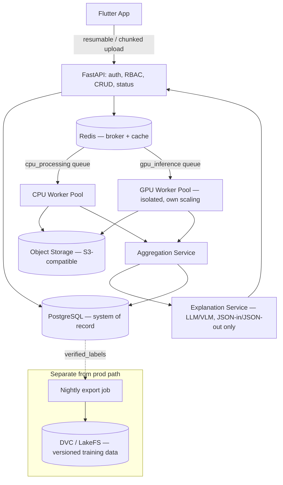

# Fasal Rakshak — Architecture Reference (Agent-Facing)

## 0. Purpose & provenance

This is the single condensed architecture reference for anyone (human or
agent) writing code in this repo. It reconciles:

- **PRD** — what the product must do for farmers/agronomists/B2B users.
- **Backend & ML Training Plan** — target-state backend/ML architecture.
- **Loopholes & Evaluation Framework** — risk mitigations, encoded below as
  architectural constraints, not suggestions.
- **Implementation Plan** — phased build order under a solo-builder / Mac M2
  Air (8GB, no dedicated GPU) hardware constraint.

Where the target-state plan and the hardware-constrained plan diverge, this
document states the thing to build **now**. The target-state is noted
separately as "grow into later." Build to the "Now" column unless a specific
backlog ticket says otherwise.

## 1. System overview

Fasal Rakshak is a **modular monolith** (single FastAPI codebase, internally
separated into modules) with **exactly one architectural split**: GPU
inference runs as an isolated, independently-scalable worker pool, because
its cost profile, scaling triggers, and failure modes are incompatible with
everything else in the system. Every video upload becomes a **durable job**
tracked by an explicit status enum in Postgres — never a synchronous
request/response — because the video→report pipeline takes 30–60s+ and can
fail at multiple independent stages.

## 2. Component diagram

## 3. Component responsibility table

| Component | Responsibility | Never does |
|---|---|---|
| FastAPI API layer | Auth, RBAC, CRUD, upload orchestration, status polling, response assembly | Never runs FFmpeg or model inference inline in a request |
| CPU Worker Pool | FFmpeg extraction, blur/exposure/motion scoring, near-dup removal, best-frame selection | Never touches GPU-bound work; own Celery queue (`cpu_processing`) |
| GPU Worker Pool | Crop classifier → detector → disease classifier, per frame | Never shares infra/autoscaling policy with CPU pool; own Celery queue (`gpu_inference`) |
| Aggregation Service | Temporal voting/Bayesian aggregation, severity estimate, Field Health Score rollup | Never re-runs vision models; operates only on stored per-frame outputs |
| Explanation Service | Calls LLM/VLM with structured JSON, validates schema, applies guardrail filter, template fallback | Never receives raw video/images; never renders unvalidated output |
| PostgreSQL | System of record for all structured data | Never stores raw video/frame bytes |
| Object Storage (S3-compatible) | Video/frame binary storage, lifecycle-policy retention | Never the source of truth for status/metadata |
| DVC/LakeFS | Versioned training dataset repo | Completely separate from production Postgres; fed only via the nightly export job |

## 4. Non-negotiable design decisions

Each of these is load-bearing. A ticket that appears to require violating one
of these should be flagged, not silently worked around.

1. **Modular monolith + one split.** FastAPI stays a single deployable at
   MVP; GPU inference is the one component allowed its own deployment and
   autoscaling policy. *(Backend Plan §1)*
2. **Durable job state machine.** Every video has a persistent
   `videos.status` enum (`uploaded → validating → processing → analyzing →
   aggregating → ready → failed | insufficient_evidence`). No stage is a bare
   synchronous HTTP call. *(Backend Plan §1, §4 Phase 1)*
3. **Queue separation from day one.** `cpu_processing` and `gpu_inference`
   are two named Celery queues even before GPU workers exist as a separate
   deployment. *(Backend Plan §2)*
4. **Every prediction row is model-version-stamped.** `detections`,
   `frame_diagnoses`, `video_diagnoses` all carry a non-nullable
   `*_model_version` column from the first migration. Without this, shadow
   comparison and regression debugging are impossible. *(Backend Plan §3)*
5. **`verified_labels` is structurally separate from `video_diagnoses`.**
   Agronomist ground truth is never written into or merged with the AI
   prediction table. *(Backend Plan §3, Loopholes §Part1.A)*
6. **`decision_authority` defaults to `advisory_only`.** Any
   `video_diagnoses` row tied to a B2B/financial-decision context requires an
   explicit `human_confirmed` transition before it can gate a real-world
   action (payout, loan decision). AI output alone never authorizes a
   financial outcome. *(Loopholes `[L13]`)*
7. **Full probability distributions are stored, not just top-1.**
   `frame_diagnoses.probability_distribution` is a JSONB full distribution.
   This is what makes re-thresholding, calibration analysis, and "Other"
   bucket mining possible without re-running inference. *(Backend Plan §3)*
8. **Train/val/test splits are video-level, enforced automatically.** Never
   frame-level. This is a pipeline assertion (a failing CI/test check), not a
   one-time manual claim. *(Loopholes `[L7]`)*
9. **Confidence bands are computed only from calibrated probabilities.**
   Temperature scaling (or equivalent post-hoc calibration) happens before
   any High/Medium/Low band is shown to a user. Raw softmax never reaches the
   UI. *(Backend Plan §7)*
10. **The LLM/VLM explanation layer sees structured JSON only — never raw
    media.** It cannot independently "diagnose" something the vision
    pipeline didn't determine. Every output passes schema validation + a
    guardrail filter before rendering, with a canned-template fallback on any
    failure. *(Backend Plan §5.6)*
11. **GPS precision is tiered by default.** Precise coordinates are
    encrypted at rest with restricted access; only geohash (~1km) or
    district-level location is exposed by default in analytics/B2B views.
    *(Backend Plan §7, PRD §32)*
12. **No model auto-promotes.** A new model must pass the release gate
    (beat the frozen regression set, no slice-level regression beyond
    threshold, pass calibration/ECE, pass the guardrail red-team suite at
    ~100%, acceptable repeat-scan consistency) before shadow, and again
    before production. *(Loopholes §Part2.10, Backend Plan §6)*
13. **Open-set routing, not forced classification.** Low-confidence or
    out-of-taxonomy predictions route to "Unable to confidently classify" +
    mandatory agronomist review — never force-fit into the nearest known
    disease class. *(Backend Plan §7)*
14. **Minimum usable-frame threshold.** Below the threshold (default: 5),
    the job resolves to `insufficient_evidence`, not a low-quality diagnosis.
    *(Backend Plan §8)*

## 5. Data flow: video → report

1. Client uploads via resumable/chunked transfer (tus or S3 multipart) →
   `videos` row created, `status = uploaded`.
2. API enqueues a `cpu_processing` task → `status = validating`.
3. CPU worker: FFmpeg scene-change-aware extraction → blur/exposure scoring
   → near-dup removal → best-frame selection → composite quality score
   (server-side, independent of any client-side score) → `status =
   processing`. If usable frames < threshold → `status = insufficient_evidence`,
   pipeline stops here.
4. API enqueues `gpu_inference` tasks per selected frame → `status =
   analyzing`.
5. GPU worker: crop classifier → detector → disease classifier per frame,
   writing `detections` + `frame_diagnoses` (full distributions,
   model-version-stamped).
6. Aggregation service: Bayesian/log-odds temporal aggregation, severity
   heuristic, open-set/OOD check → writes one `video_diagnoses` row →
   `status = aggregating` then `ready`.
7. Explanation service (on-demand or eagerly on `ready`): structured JSON →
   LLM/VLM → schema validation → guardrail filter → farmer report.
8. Feedback (farmer) and verification (agronomist) write to `feedback` and
   `verified_labels` respectively — both structurally separate from
   `video_diagnoses`.
9. Nightly export job pushes new `verified_labels` (2+ agronomist consensus
   only, for "gold") into the DVC/LakeFS dataset repo.

## 6. Environment matrix — local dev (Mac-safe) vs. pilot/production

| Component | Local dev (Mac M2, 8GB, no GPU) | Pilot / production |
|---|---|---|
| Postgres | Managed free-tier cloud Postgres (Neon/Supabase-style) — not a local container running alongside everything else | Managed cloud Postgres, scaled |
| Redis | Managed free-tier cloud Redis (Upstash-style) | Managed cloud Redis |
| Object storage | Cloudflare R2 / Backblaze B2 from day one — never accumulate video on local disk | Same, with lifecycle/retention policy enforced |
| Container runtime | OrbStack (lighter than Docker Desktop on 8GB RAM) | Standard container orchestration |
| Model training | Google Colab / Kaggle notebooks (free GPU quota); only final weights (tens–hundreds of MB) sync to the repo | Same, or dedicated training infra once volume justifies it |
| GPU inference | Rented on-demand cloud GPU (RunPod/Vast.ai spot) or serverless (Modal, Replicate, HF Inference Endpoints), called from local orchestration code | Dedicated GPU worker pool (Triton/TorchServe once volume justifies dynamic batching) |
| Mobile testing | Physical device over USB/wireless debugging, not an emulator | Standard device farm / physical QA |

**Rule of thumb:** if a task needs a GPU for more than a few seconds, or
needs to store more than a few hundred MB, it does not run on the laptop —
it runs in the cloud, with the laptop only orchestrating.

## 7. Queues & job states

- Celery queues: `cpu_processing`, `gpu_inference` (from Phase 2 onward, even
  before GPU workers are a separate deployment).
- `videos.status` enum: `uploaded → validating → processing → analyzing →
  aggregating → ready → failed | insufficient_evidence`.
- `model_versions.deployment_status` enum: `shadow → canary → production →
  retired`. Transition `shadow/canary → production` is gated by the release
  checklist (§9 of the Testing/Eval Strategy doc), not a manual flip.

## 8. Non-goals for MVP (unchanged from PRD §4)

Do not build: multi-crop support, exhaustive disease coverage, autonomous
pesticide prescription, agronomist replacement, guaranteed diagnosis,
satellite analytics, IoT hardware, autonomous spraying, Triton/TorchServe (defer
until volume justifies), a learned aggregation meta-model (defer until
enough video-level ground truth exists), OLAP/read-replica layer (defer
until B2B volume makes OLTP slow).

## 9. Cross-references

- Table-level schema: `Fasal_Rakshak_03_Data_Model_Schema.md`
- Endpoint contracts: `Fasal_Rakshak_04_API_Specification.md`
- Phase-by-phase ticketed build order: `Fasal_Rakshak_05_Agentic_Phase_Backlog.md`
- Standing agent rules derived from §4 above: `Fasal_Rakshak_07_CLAUDE_Agent_Instructions.md`