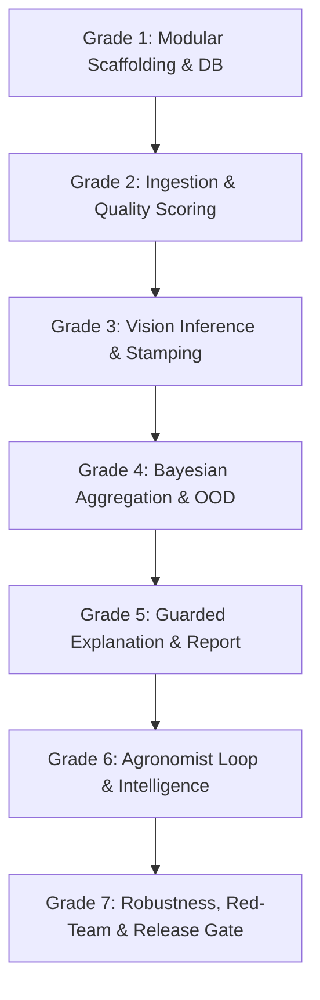

# Fasal Rakshak AI — Phase-Wise Graded Implementation Plan

## Executive Overview & Architectural Strategy

This implementation plan delivers a **Phase-Wise Graded** execution roadmap for Fasal Rakshak AI. It directly reconciles the **7-Day MVP Sprint** ([phase-plan.md](file:///Users/adityamaharana/Desktop/rakshak/Rakshak-AI/docs/mvp_wk1/phase-plan.md)) with the **30-Week Complete Production Architecture** ([Fasal_Rakshak_01_Architecture_Reference.md](file:///Users/adityamaharana/Desktop/rakshak/Rakshak-AI/docs/architecture/Fasal_Rakshak_01_Architecture_Reference.md), [Fasal_Rakshak_02_Repo_Structure.md](file:///Users/adityamaharana/Desktop/rakshak/Rakshak-AI/docs/architecture/Fasal_Rakshak_02_Repo_Structure.md), [Fasal_Rakshak_03_Data_Model_Schema.md](file:///Users/adityamaharana/Desktop/rakshak/Rakshak-AI/docs/architecture/Fasal_Rakshak_03_Data_Model_Schema.md), [Fasal_Rakshak_04_API_Specification.md](file:///Users/adityamaharana/Desktop/rakshak/Rakshak-AI/docs/architecture/Fasal_Rakshak_04_API_Specification.md), [Fasal_Rakshak_05_Agentic_Phase_Backlog.md](file:///Users/adityamaharana/Desktop/rakshak/Rakshak-AI/docs/backlog/Fasal_Rakshak_05_Agentic_Phase_Backlog.md), and [CLAUDE.md](file:///Users/adityamaharana/Desktop/rakshak/Rakshak-AI/docs/CLAUDE.md)).

### The "Graded" Progression Strategy
To ensure immediate demo readiness without creating technical debt or throwaway code:
- **Grade 1 (Foundations & Scaffolding):** Establishes the canonical modular monolith layout, base database schema with non-nullable model version columns, JWT auth skeleton, and `/healthz`.
- **Grade 2 (Ingestion & Quality Pipeline):** Implements video upload, server-side FFmpeg extraction, Laplacian blur + exposure filtering, near-duplicate pruning, and `< 5` usable frames `insufficient_evidence` routing.
- **Grade 3 (Vision Inference & Taxonomy):** Wires CPU-safe pretrained YOLO detector and disease classifier, outputting full probability distributions stamped with model version IDs.
- **Grade 4 (Temporal Aggregation & Severity):** Implements Bayesian/confidence-weighted multi-frame aggregation, 4-level severity estimation, and OOD open-set "Unknown" routing.
- **Grade 5 (Guarded Explanation & Farmer Report):** Structured JSON-to-LLM bridge, regex/phrase certainty guardrail filter, canned template fallback, and PRD §30 report schema.
- **Grade 6 (Verification Loop & Field Intelligence):** Structurally separate agronomist verification queue, farmer feedback, and Field Health Score rollups.
- **Grade 7 (Robustness, Red-Teaming & Scale Hardening):** Test suite, adversarial guardrail tests, rate limiting, and automated release gate enforcement.

---

## Non-Negotiable Standing Invariants

These rules govern all grades and must never be bypassed:
1. **Never overstate certainty:** The explanation layer and UI must display `"AI estimate, not a confirmed diagnosis"`. Low-quality or ambiguous scans must route to `insufficient_evidence` or `"Unable to confidently classify"`.
2. **Structured JSON only to LLM:** The LLM receives strictly validated JSON; it never receives raw video/images.
3. **Guardrail filter with canned fallback:** Every generated explanation is scanned for certainty assertions (e.g., *"100% cure"*, *"definitely"*, *"guaranteed"*, unverified chemical advice); failure triggers deterministic template fallback.
4. **Durable status transitions:** Persistent `videos.status` tracking: `uploaded → validating → processing → analyzing → aggregating → ready | failed | insufficient_evidence`.
5. **Model version stamping:** Every prediction row carries non-nullable `*_model_version` strings.
6. **Structural separation:** Agronomist `verified_labels` are never merged with automated `video_diagnoses`.
7. **Advisory-only default:** `decision_authority` is hardcoded to `advisory_only` unless explicitly upgraded to `human_confirmed`.
8. **Hardware safety:** Zero model training on local Mac M2; CPU inference on dev/staging, remote endpoint for GPU tasks.

---

## Graded Phase Breakdown

---

### Grade 1 — Foundations, Modular Scaffolding & Database Schema
**Backlog Alignment:** `FR-P1-01` to `FR-P1-06` | **MVP Sprint:** Day 1

#### 1. Objectives & Scope
- Establish canonical monorepo architecture per `Fasal_Rakshak_02_Repo_Structure.md`.
- Deploy SQLAlchemy async DB engine and models matching `Fasal_Rakshak_03_Data_Model_Schema.md`.
- Implement JWT authentication with role hierarchy (`farmer`, `agronomist`, `admin`, `enterprise`) and demo access gate.
- Setup structured JSON logging with correlation `request_id` and `/healthz` endpoint.

#### 2. Code Changes
- [NEW] [backend/app/core/config.py](file:///Users/adityamaharana/Desktop/rakshak/Rakshak-AI/backend/app/core/config.py): Pydantic `Settings` reading environment variables.
- [NEW] [backend/app/core/security.py](file:///Users/adityamaharana/Desktop/rakshak/Rakshak-AI/backend/app/core/security.py): JWT token hashing/validation & password utilities.
- [NEW] [backend/app/core/logging.py](file:///Users/adityamaharana/Desktop/rakshak/Rakshak-AI/backend/app/core/logging.py): Structured JSON logging middleware with `request_id`.
- [NEW] [backend/app/core/deps.py](file:///Users/adityamaharana/Desktop/rakshak/Rakshak-AI/backend/app/core/deps.py): FastAPI dependencies (`get_db`, `get_current_user`, `require_role`).
- [NEW] [backend/app/db/base.py](file:///Users/adityamaharana/Desktop/rakshak/Rakshak-AI/backend/app/db/base.py) & [session.py](file:///Users/adityamaharana/Desktop/rakshak/Rakshak-AI/backend/app/db/session.py): SQLAlchemy declarative Base and async session maker.
- [NEW] [backend/app/models/identity.py](file:///Users/adityamaharana/Desktop/rakshak/Rakshak-AI/backend/app/models/identity.py): `users` and `organizations` tables.
- [NEW] [backend/app/models/farm.py](file:///Users/adityamaharana/Desktop/rakshak/Rakshak-AI/backend/app/models/farm.py): `farms`, `fields`, `crops`, `diseases` (launch taxonomy seed).
- [NEW] [backend/app/models/video.py](file:///Users/adityamaharana/Desktop/rakshak/Rakshak-AI/backend/app/models/video.py): `videos` and `frames` schema with `video_status` enum.
- [NEW] [backend/app/models/prediction.py](file:///Users/adityamaharana/Desktop/rakshak/Rakshak-AI/backend/app/models/prediction.py): `detections`, `frame_diagnoses`, `video_diagnoses` with `*_model_version` and `decision_authority: advisory_only`.
- [NEW] [backend/app/models/verification.py](file:///Users/adityamaharana/Desktop/rakshak/Rakshak-AI/backend/app/models/verification.py): `verified_labels` and `feedback`.
- [MODIFY] [backend/app/main.py](file:///Users/adityamaharana/Desktop/rakshak/Rakshak-AI/backend/app/main.py): Assemble modular routers and expose `/healthz`.

#### 3. Exit Criteria
- `GET /healthz` returns `{"status": "ok", "service": "rakshak-api"}` (HTTP 200).
- Database tables initialize cleanly with all enum types and indexes.
- Protected endpoints correctly enforce 401/403 across roles.

---

### Grade 2 — Ingestion, Frame Extraction & Server-Side Quality Scoring
**Backlog Alignment:** `FR-P2-01` to `FR-P2-07` | **MVP Sprint:** Day 2

#### 1. Objectives & Scope
- Handle multipart video uploads with validation and storage staging.
- Implement server-side frame extraction via OpenCV/FFmpeg (fixed-interval & scene-change sampling).
- Server-side quality scoring:
  - Variance of Laplacian for blur detection.
  - Histogram analysis for over/underexposure.
  - Perceptual difference for near-duplicate pruning.
- Minimum usable-frame threshold (default: 5): If `< 5` usable frames remain, transition status to `insufficient_evidence` and halt pipeline gracefully.
- Persistent state machine in background task (`uploaded → validating → processing`).

#### 2. Code Changes
- [NEW] [backend/app/modules/ingestion/service.py](file:///Users/adityamaharana/Desktop/rakshak/Rakshak-AI/backend/app/modules/ingestion/service.py): Video creation, storage persistence, status management.
- [NEW] [backend/app/modules/processing/extractor.py](file:///Users/adityamaharana/Desktop/rakshak/Rakshak-AI/backend/app/modules/processing/extractor.py): Video decoding & frame extraction.
- [NEW] [backend/app/modules/processing/quality.py](file:///Users/adityamaharana/Desktop/rakshak/Rakshak-AI/backend/app/modules/processing/quality.py): Blur, exposure, and near-duplicate scoring algorithms.
- [NEW] [backend/app/schemas/video.py](file:///Users/adityamaharana/Desktop/rakshak/Rakshak-AI/backend/app/schemas/video.py): Pydantic request/response models for video upload and status.
- [NEW] [backend/app/api/v1/videos.py](file:///Users/adityamaharana/Desktop/rakshak/Rakshak-AI/backend/app/api/v1/videos.py): `POST /api/v1/videos` and `GET /api/v1/videos/{video_id}/status`.
- [NEW] [frontend/web/app/components/VideoUpload.tsx](file:///Users/adityamaharana/Desktop/rakshak/Rakshak-AI/frontend/web/app/components/VideoUpload.tsx): Video dropzone / camera capture with live upload progress.

#### 3. Exit Criteria
- Uploading a valid video extracts frames, writes quality scores, and updates `videos.status` to `processing`.
- Uploading an invalid/blurry video with `< 5` usable frames resolves to `videos.status = insufficient_evidence`.
- `GET /api/v1/videos/{id}/status` returns real-time progress.

---

### Grade 3 — Vision Inference, Taxonomy Lock & Version Stamping
**Backlog Alignment:** `FR-P3-01` to `FR-P4-05` | **MVP Sprint:** Day 3

#### 1. Objectives & Scope
- Implement modular inference adapter supporting local CPU execution (lightweight PyTorch/ONNX/Torchvision models for plant/leaf detection and soybean disease classification).
- Enforce launch disease taxonomy: `Soybean Rust`, `Bacterial Blight`, `Frogeye Leaf Spot`, `Septoria Brown Spot`, `Healthy`, `Other/Unknown`.
- Store full probability distributions in `frame_diagnoses.probability_distribution` (never just top-1).
- Enforce mandatory model version stamping (`detector_model_version`, `classifier_model_version`) on every detection/diagnosis record.

#### 2. Code Changes
- [NEW] [backend/app/modules/inference/detector.py](file:///Users/adityamaharana/Desktop/rakshak/Rakshak-AI/backend/app/modules/inference/detector.py): Plant and leaf region detection with bounding boxes and confidence.
- [NEW] [backend/app/modules/inference/classifier.py](file:///Users/adityamaharana/Desktop/rakshak/Rakshak-AI/backend/app/modules/inference/classifier.py): Disease classification generating full probability distributions over classes.
- [NEW] [backend/app/modules/inference/service.py](file:///Users/adityamaharana/Desktop/rakshak/Rakshak-AI/backend/app/modules/inference/service.py): Frame inference orchestration & version metadata attachment.
- [NEW] [backend/app/api/v1/analysis.py](file:///Users/adityamaharana/Desktop/rakshak/Rakshak-AI/backend/app/api/v1/analysis.py): `GET /api/v1/videos/{video_id}/analysis` returning raw vision metrics.

#### 3. Exit Criteria
- Inference generates full probability distributions across all frames.
- 100% of prediction records carry non-nullable `*_model_version` strings.
- Pipeline transitions `videos.status` from `analyzing` to `aggregating`.

---

### Grade 4 — Temporal Aggregation, Severity Heuristic & OOD Routing
**Backlog Alignment:** `FR-P5-01` to `FR-P5-06` | **MVP Sprint:** Day 3–4

#### 1. Objectives & Scope
- Multi-frame confidence-weighted Bayesian aggregation (weighting frame detection confidence × frame quality score).
- 4-level severity estimation (None, Mild, Moderate, Severe) derived from lesion detection density and affected plant percentage.
- Open-set out-of-distribution (OOD) routing: If max confidence falls below threshold or entropy is high, route to `is_unknown = true` ("Unable to confidently classify").
- Conservative confidence bands: High (≥ 90%), Medium (70–89%), Low (< 70%).

#### 2. Code Changes
- [NEW] [backend/app/modules/aggregation/bayes.py](file:///Users/adityamaharana/Desktop/rakshak/Rakshak-AI/backend/app/modules/aggregation/bayes.py): Multi-frame temporal voting and Bayesian confidence rollup.
- [NEW] [backend/app/modules/aggregation/severity.py](file:///Users/adityamaharana/Desktop/rakshak/Rakshak-AI/backend/app/modules/aggregation/severity.py): Severity level and affected plant area calculation.
- [NEW] [backend/app/modules/aggregation/service.py](file:///Users/adityamaharana/Desktop/rakshak/Rakshak-AI/backend/app/modules/aggregation/service.py): Aggregation orchestration and `video_diagnoses` persistence.

#### 3. Exit Criteria
- Temporal aggregation outputs a single consolidated diagnosis from multi-frame evidence.
- Out-of-distribution / non-soybean frames correctly resolve to `is_unknown = true`.
- Output is saved to `video_diagnoses` with `decision_authority = advisory_only`.

---

### Grade 5 — Guarded Explanation Layer, Certainty Guardrail & PRD §30 Report
**Backlog Alignment:** `FR-P6-01` to `FR-P6-06` | **MVP Sprint:** Day 4–5

#### 1. Objectives & Scope
- Structured JSON-in / JSON-out bridge to LLM (structured input: crop, disease, confidence, severity, frame evidence; never raw images/video).
- Strict output validation against Pydantic schema before rendering.
- Regex and phrase guardrail filter rejecting overconfident assertions (e.g. *"100% cure"*, *"definitely"*, *"guaranteed"*), or autonomous pesticide dosage advice.
- Deterministic canned report generator for fallback on any validation/guardrail rejection.
- Farmer-facing report presentation matching PRD §30 data contract.

#### 2. Code Changes
- [NEW] [backend/app/guardrails/certainty_filter.py](file:///Users/adityamaharana/Desktop/rakshak/Rakshak-AI/backend/app/guardrails/certainty_filter.py): Regex & phrase validator for generated copy.
- [NEW] [backend/app/modules/reporting/templates.py](file:///Users/adityamaharana/Desktop/rakshak/Rakshak-AI/backend/app/modules/reporting/templates.py): Deterministic canned fallback report templates for all launch diseases.
- [NEW] [backend/app/modules/reporting/explainer.py](file:///Users/adityamaharana/Desktop/rakshak/Rakshak-AI/backend/app/modules/reporting/explainer.py): LLM prompt builder (JSON only), invocation, validation, and guardrail enforcement.
- [NEW] [backend/app/schemas/diagnosis.py](file:///Users/adityamaharana/Desktop/rakshak/Rakshak-AI/backend/app/schemas/diagnosis.py): Pydantic models for farmer diagnosis report.
- [NEW] [backend/app/api/v1/diagnosis.py](file:///Users/adityamaharana/Desktop/rakshak/Rakshak-AI/backend/app/api/v1/diagnosis.py): `GET /api/v1/diagnosis/{id}` and `POST /api/v1/diagnosis/{id}/feedback`.
- [NEW] [frontend/web/app/components/DiagnosisReport.tsx](file:///Users/adityamaharana/Desktop/rakshak/Rakshak-AI/frontend/web/app/components/DiagnosisReport.tsx): Report UI with disease badge, confidence disclaimer, severity gauge, evidence gallery, and action cards.

#### 3. Exit Criteria
- 100% of LLM calls receive structured JSON only.
- Guardrail test cases with overconfident language successfully trigger template fallback.
- `GET /api/v1/diagnosis/{id}` returns the PRD §30 format with `"AI estimate, not a confirmed diagnosis"` banner.

---

### Grade 6 — Agronomist Verification Loop & Field Health Intelligence
**Backlog Alignment:** `FR-P7-01` to `FR-P7-06`, `FR-P9-01` to `FR-P9-02` | **MVP Sprint:** Day 5–6

#### 1. Objectives & Scope
- Structurally separate `verified_labels` write endpoint for expert agronomists (`POST /api/v1/diagnosis/{id}/verify`).
- Independent severity ground truth (`affected_plant_estimate_independent`) required from agronomist (never pre-filled from AI).
- Agronomist review queue sorted by lowest AI confidence first (`GET /api/v1/agronomist/queue`).
- Field Health Score calculation (0–100) combining disease prevalence, severity, and healthy ratios.
- B2B dashboard summary endpoint (`GET /api/v1/b2b/dashboard`).

#### 2. Code Changes
- [NEW] [backend/app/modules/agronomist/service.py](file:///Users/adityamaharana/Desktop/rakshak/Rakshak-AI/backend/app/modules/agronomist/service.py): Queue generation & verification persistence.
- [NEW] [backend/app/modules/field_intelligence/service.py](file:///Users/adityamaharana/Desktop/rakshak/Rakshak-AI/backend/app/modules/field_intelligence/service.py): Field Health Score & B2B metrics rollup.
- [NEW] [backend/app/api/v1/agronomist.py](file:///Users/adityamaharana/Desktop/rakshak/Rakshak-AI/backend/app/api/v1/agronomist.py): `GET /api/v1/agronomist/queue` and `GET /api/v1/agronomist/cases/{id}`.
- [NEW] [backend/app/api/v1/b2b.py](file:///Users/adityamaharana/Desktop/rakshak/Rakshak-AI/backend/app/api/v1/b2b.py): `GET /api/v1/b2b/dashboard` and `GET /api/v1/b2b/drilldown`.
- [NEW] [frontend/web/app/agronomist/page.tsx](file:///Users/adityamaharana/Desktop/rakshak/Rakshak-AI/frontend/web/app/agronomist/page.tsx): Agronomist verification queue & case view.
- [NEW] [frontend/web/app/dashboard/page.tsx](file:///Users/adityamaharana/Desktop/rakshak/Rakshak-AI/frontend/web/app/dashboard/page.tsx): Field Health & B2B aggregate analytics dashboard.

#### 3. Exit Criteria
- Agronomist verification writes directly to `verified_labels` without altering `video_diagnoses`.
- Queue displays lowest confidence cases at the top.
- Field Health Score correctly responds to verified and diagnosed field conditions.

---

### Grade 7 — Robustness, Red-Teaming, Automated Gate & Scale Hardening
**Backlog Alignment:** `FR-P8-01` to `FR-P10-06` | **MVP Sprint:** Day 6–7 & Production Ready

#### 1. Objectives & Scope
- Build comprehensive automated test suite across unit, integration, and guardrail layers.
- Implement rate limiting and request payload size caps.
- Create automated release gate verification script checking regression thresholds, calibration, and guardrail pass rates.
- Curate 8–10 test fixtures (clean soybean rust, bacterial blight, blurry, underexposed, non-plant).
- Complete live demo rehearsal package with recorded fallback clips.

#### 2. Code Changes
- [NEW] [backend/tests/unit/modules/processing/test_quality.py](file:///Users/adityamaharana/Desktop/rakshak/Rakshak-AI/backend/tests/unit/modules/processing/test_quality.py): Unit tests for blur, exposure, and near-dup pruning.
- [NEW] [backend/tests/unit/modules/aggregation/test_bayes.py](file:///Users/adityamaharana/Desktop/rakshak/Rakshak-AI/backend/tests/unit/modules/aggregation/test_bayes.py): Unit tests for Bayesian aggregation and OOD thresholding.
- [NEW] [backend/tests/guardrail_redteam/test_guardrails.py](file:///Users/adityamaharana/Desktop/rakshak/Rakshak-AI/backend/tests/guardrail_redteam/test_guardrails.py): Adversarial LLM red-teaming test suite.
- [NEW] [backend/tests/integration/test_pipeline_e2e.py](file:///Users/adityamaharana/Desktop/rakshak/Rakshak-AI/backend/tests/integration/test_pipeline_e2e.py): End-to-end upload → extraction → inference → aggregation → report test.
- [NEW] [scripts/smoke_test_pipeline.py](file:///Users/adityamaharana/Desktop/rakshak/Rakshak-AI/scripts/smoke_test_pipeline.py): CLI verification tool for pipeline validation.

#### 3. Exit Criteria
- All unit, integration, and guardrail tests pass with 100% pass rate.
- Bad input videos reliably route to `insufficient_evidence` without pipeline crashing.
- Demo playbook and fallback video artifact ready for presentation.

---

## Graded Verification Plan

| Grade | Automated Test Suite | Manual / Live Verification |
|---|---|---|
| **Grade 1** | `pytest backend/tests/unit/core/test_auth.py` | `curl -i http://localhost:8000/healthz` returns 200 |
| **Grade 2** | `pytest backend/tests/unit/modules/processing/` | Upload sample video; inspect extracted frames & blur scores |
| **Grade 3** | `pytest backend/tests/unit/modules/inference/` | Verify full probability distribution & `*_model_version` tags in DB |
| **Grade 4** | `pytest backend/tests/unit/modules/aggregation/` | Submit multi-frame results; verify Bayesian score & OOD routing |
| **Grade 5** | `pytest backend/tests/guardrail_redteam/` | Run red-team suite; verify UI renders PRD §30 report layout |
| **Grade 6** | `pytest backend/tests/unit/modules/agronomist/` | Submit agronomist verification; verify separation in DB |
| **Grade 7** | `pytest backend/tests/integration/` | Run `python scripts/smoke_test_pipeline.py` end-to-end |
