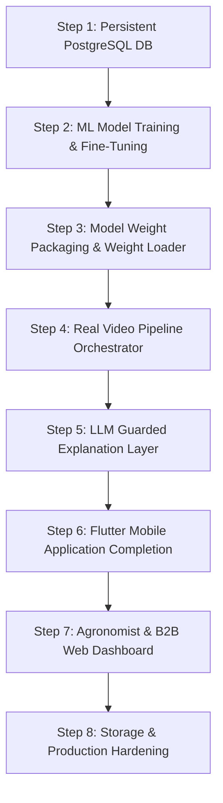

# Fasal Rakshak AI — Complete Production & MVP Implementation Plan
### Updated: August 27, 2026

---

## Executive Summary & Current State Audit

A technical audit of the codebase reveals the current status across all layers:

| Layer | Component | Current Code State | What is Missing for Full Production |
|---|---|---|---|
| **Database** | SQLAlchemy Async ORM | Schema complete with 6 models | Running on `/tmp/rakshak.db` (ephemeral SQLite). **Needs Neon PostgreSQL**. |
| **API Server** | FastAPI Endpoints | Live on Render (`/healthz`, auth, video, farm, agronomist, B2B) | Needs real pipeline execution hook & persistent JWT secret. |
| **Ingestion** | Ingestion & Storage | Upload & status endpoints live | `run_pipeline` task not wired after upload. Storage lost on container restart. |
| **Object Detection** | Plant/Leaf Detector | Generic COCO Faster R-CNN fallback in `detector.py` | **Custom YOLOv8n/11n model fine-tuned on plant/leaf/lesion dataset missing.** |
| **Classifier** | Disease Classifier | EfficientNet-B0 with **randomly initialized head** in `classifier.py` | **PyTorch fine-tuning on Soybean disease dataset (6 classes) missing.** |
| **Aggregation** | Bayesian Rollup | `bayes.py` & `severity.py` algorithms complete | Needs execution within the pipeline. |
| **LLM Explainer** | Guarded Explanation | `templates.py` & `certainty_filter.py` exist | `explainer.py` (LLM call + JSON prompt + fallback trigger) missing. |
| **Mobile App** | Flutter Client | Login screen + mock `api_client.dart` | **Full scan, upload polling, report UI, farm creation, and persistent auth missing.** |
| **Web Admin** | Agronomist / B2B | API endpoints ready | No web UI built. |

---

## Complete Step-by-Step Implementation Roadmap



---

### STEP 1 — Persistent PostgreSQL Database & Auth Security
**Priority: 🔴 CRITICAL — Blocker for data persistence**

The current SQLite database is created in `/tmp/rakshak.db`. Render containers are ephemeral; every restart or redeploy completely wipes all registered users, farms, and diagnoses.

#### 1.1 Provision Managed PostgreSQL (Neon / Supabase)
- Provision a free managed PostgreSQL instance on **Neon.tech** or **Supabase**.
- Copy connection string: `postgresql://<user>:<password>@<host>/<dbname>?sslmode=require`.
- Convert connection URL driver prefix to async format: `postgresql+psycopg://...`.

#### 1.2 Update Render Environment Variables
- Set `DATABASE_URL` in Render service dashboard to the `postgresql+psycopg://...` URI.
- Update [`render.yaml`](file:///Users/adityamaharana/Desktop/rakshak/Rakshak-AI/render.yaml):
  - Mark `DATABASE_URL` as `sync: false` (managed out-of-band).
  - Mark `JWT_SECRET_KEY` as `sync: false` and set a static 64-character secret in Render environment settings to prevent token invalidation across redeploys.

#### 1.3 Schema Auto-Migration
- Keep `Base.metadata.create_all` in `main.py` lifespan (or initialize Alembic migrations for production schema evolution).

---

### STEP 2 — Machine Learning Model Training & Fine-Tuning Pipeline
**Priority: 🔴 CRITICAL — Replaces generic backbones with real domain AI**

Currently, `detector.py` uses a generic COCO Faster R-CNN, and `classifier.py` uses an EfficientNet-B0 with a randomly initialized final linear layer. To achieve real agricultural disease diagnostics, we must train and fine-tune custom vision models.

#### 2.1 Model 1: Plant & Leaf Bounding Box Detector (YOLOv8n / YOLO11n)
- **Objective:** Detect `plant`, `leaf`, `diseased_leaf`, and `lesion` bounding boxes in field video frames.
- **Dataset:** Combine **PlantDoc** detection dataset with custom annotated field leaf bounding boxes (YOLO format: `class x_center y_center width height`).
- **Training Script (`scripts/train_detector.py`):**
  - Fine-tune `yolov8n.pt` / `yolo11n.pt` using `ultralytics`.
  - Input resolution: 640x640.
  - Epochs: 50–100 with early stopping, mosaic augmentation, and random flip/rotate.
  - Save best weights as `weights/soybean_detector_yolov8n.pt` (or export to ONNX `soybean_detector_yolov8n.onnx`).
- **Target Metrics:** mAP50 ≥ 0.85 on plant/leaf detection.

#### 2.2 Model 2: Soybean Disease Classifier (EfficientNet-B0 / ResNet-50)
- **Objective:** Classify cropped leaf/lesion regions into the launch taxonomy:
  1. `soybean_rust` (Phakopsora pachyrhizi)
  2. `bacterial_blight` (Pseudomonas savastanoi)
  3. `frogeye_leaf_spot` (Cercospora sojina)
  4. `septoria_brown_spot` (Septoria glycines)
  5. `healthy`
  6. `unknown_other`
- **Dataset:** Combine **PlantVillage** soybean subset + **Soybean Leaf Disease Dataset** + unlabelled background/crop images for `unknown_other`.
- **Training Script (`scripts/train_classifier.py`):**
  - Backbone: Pretrained `torchvision.models.efficientnet_b0`.
  - Loss: CrossEntropyLoss with Label Smoothing (0.1).
  - Augmentation: RandomResizedCrop(224), ColorJitter, RandomHorizontalFlip, RandomRotation(15).
  - Optimizer: AdamW (lr=1e-3, weight_decay=1e-4) with CosineAnnealingLR.
  - Save best checkpoint: `weights/soybean_classifier_effnet_b0.pt`.
- **Target Metrics:** Top-1 Accuracy ≥ 90%, F1-score ≥ 0.88 across all 6 classes.

---

### STEP 3 — Model Weight Packaging, Loading & Download Hooks
**Priority: 🔴 CRITICAL — Wiring trained weights into production**

Large model weights (`.pt`/`.onnx` files, ~15–50 MB each) should not be committed directly into Git repository root due to size limits.

#### 3.1 Model Storage & Download Script (`scripts/download_weights.py`)
- Upload trained model weights to Cloudflare R2 / AWS S3 / GitHub Release assets.
- Create automated download helper:
  ```python
  # Downloads weights on startup or build if not present locally
  # Target directory: backend/app/weights/
  #   - soybean_detector_yolov8n.pt
  #   - soybean_classifier_effnet_b0.pt
  ```

#### 3.2 Update `PlantDetector` in [`detector.py`](file:///Users/adityamaharana/Desktop/rakshak/Rakshak-AI/backend/app/modules/inference/detector.py)
- Replace torchvision Faster R-CNN with `ultralytics.YOLO("app/weights/soybean_detector_yolov8n.pt")` or ONNX Runtime inference.
- Parse YOLO bounding boxes `(x_center, y_center, width, height)` normalized to `[0,1]`.
- Set `detector_model_version = "yolov8n-soybean-v1.0"`.

#### 3.3 Update `DiseaseClassifier` in [`classifier.py`](file:///Users/adityamaharana/Desktop/rakshak/Rakshak-AI/backend/app/modules/inference/classifier.py)
- Load trained PyTorch `state_dict` from `app/weights/soybean_classifier_effnet_b0.pt`.
- Compute softmax probabilities over the 6 taxonomy classes.
- Set `classifier_model_version = "effnet-b0-soybean-v1.0"`.
- Enforce OOD routing: if `max_confidence < 0.30` or `unknown_other > 0.45`, flag `is_unknown = True`.

---

### STEP 4 — Complete End-to-End Pipeline Orchestration
**Priority: 🔴 CRITICAL — Real video execution engine**

Wire the ingestion, frame extraction, quality filter, vision inference, Bayesian aggregation, and database writing into a background execution engine.

#### 4.1 Implement `run_pipeline(video_id)` in [`backend/app/pipeline.py`](file:///Users/adityamaharana/Desktop/rakshak/Rakshak-AI/backend/app/pipeline.py)
```
video.status = "validating"
  └─ Extract frames via OpenCV (extractor.py)
  └─ Calculate Laplacian blur & exposure scores (quality.py)
  └─ Filter near-duplicate frames
  └─ IF usable_frames < MIN_USABLE_FRAMES_THRESHOLD (5):
        Set video.status = "insufficient_evidence" → STOP

video.status = "analyzing"
  └─ For each selected frame:
        Run PlantDetector -> create Detection records
        Run DiseaseClassifier on cropped regions -> create FrameDiagnosis records

video.status = "aggregating"
  └─ Run Bayesian Temporal Aggregator (bayes.py)
  └─ Calculate Severity Level 0-3 & Affected Plant % (severity.py)
  └─ Write VideoDiagnosis record (decision_authority: advisory_only)

video.status = "ready"
```

#### 4.2 Wire Background Execution
- Update [`backend/app/api/v1/videos.py`](file:///Users/adityamaharana/Desktop/rakshak/Rakshak-AI/backend/app/api/v1/videos.py):
  ```python
  @router.post("", response_model=VideoUploadResponse, status_code=202)
  async def upload_video(..., background_tasks: BackgroundTasks):
      # Save video file
      # Create Video DB record
      background_tasks.add_task(run_pipeline_task, video.id)
      return VideoUploadResponse(...)
  ```

---

### STEP 5 — LLM Explanation Layer & Certainty Guardrails
**Priority: 🟡 IMPORTANT — Generative farmer advisory**

#### 5.1 Implement Explainer Service (`backend/app/modules/reporting/explainer.py`)
- Accepts `VideoDiagnosis` structured data (disease, confidence, severity, affected_pct, crop).
- Constructs strict JSON prompt for LLM (Gemini 1.5 Flash / OpenAI GPT-4o-mini).
- Parses structured response containing:
  - `farmer_summary`: Simple explanation in plain language.
  - `recommended_actions`: Agronomic management steps (fungicide application window, cultural controls).
  - `disclaimer`: `"AI estimate, not a confirmed diagnosis"`.

#### 5.2 Validate Guardrails & Canned Fallback
- Pass generated response through [`certainty_filter.py`](file:///Users/adityamaharana/Desktop/rakshak/Rakshak-AI/backend/app/guardrails/certainty_filter.py).
- If response contains absolute claims (*"100% cure"*, *"definitely"*, *"guaranteed"*) or unverified chemical advice:
  - Reject LLM output.
  - Fall back to deterministic template from [`templates.py`](file:///Users/adityamaharana/Desktop/rakshak/Rakshak-AI/backend/app/modules/reporting/templates.py).

---

### STEP 6 — Flutter Mobile Application Completion
**Priority: 🔴 CRITICAL — Primary farmer interface**

#### 6.1 Complete `ApiClient` ([`frontend/mobile/lib/api_client.dart`](file:///Users/adityamaharana/Desktop/rakshak/Rakshak-AI/frontend/mobile/lib/api_client.dart))
- Implement API methods: `login`, `register`, `getFarms`, `createFarm`, `getFields`, `uploadVideo`, `getVideoStatus`, `getDiagnosis`, `submitFeedback`.
- Add token storage via `shared_preferences` and attach `Authorization: Bearer <token>` to headers.
- Configure configurable backend URL (`kApiBaseUrl`).

#### 6.2 Complete Screens
- **`login_screen.dart` / `welcome_screen.dart`**: Complete authentication flow.
- **`home_screen.dart`**: List farmer's farms & fields; display health badges; navigate to scan screen.
- **`scan_screen.dart`**: Camera capture / video picker; upload with progress indicator; poll `GET /videos/{id}/status` until status is `ready` or `insufficient_evidence`.
- **`report_screen.dart`**: Render diagnosis, severity level, confidence band, disclaimer banner, recommended actions, and feedback button.

---

### STEP 7 — Agronomist Verification & B2B Web Dashboard
**Priority: 🟡 IMPORTANT — Agronomist review & enterprise analytics**

#### 7.1 Complete Agronomist Queue Service (`backend/app/modules/agronomist/service.py`)
- Fetch unverified diagnoses sorted by lowest confidence first.
- Submit verification (`POST /api/v1/diagnosis/{id}/verify`) writing strictly to `verified_labels` table.

#### 7.2 Web Dashboard (Next.js / HTML+JS)
- **Agronomist Portal**: View review queue, inspect frame bounding boxes, submit expert verification.
- **B2B Analytics Portal**: View aggregate Field Health Scores, disease prevalence maps across districts.

---

### STEP 8 — Production Object Storage & Scale Hardening
**Priority: 🟢 HIGH QUALITY — Production readiness**

#### 8.1 Object Storage Setup (Cloudflare R2 / AWS S3)
- Configure `storage.py` to upload raw videos and frame images to Cloudflare R2 / AWS S3.
- Generate presigned URLs for frame image viewing in frontend apps.

#### 8.2 Production Hardening
- Add request rate-limiting with `slowapi` on `/api/v1/videos` (e.g., 10 uploads/minute per user).
- Add 100 MB file size limit validation on uploads.
- Run complete test suite (`pytest`) covering unit tests, pipeline integration tests, and guardrail red-teaming tests.

---

## Milestone Execution Schedule

| Phase | Tasks | Estimated Duration | Target Completion |
|---|---|---|---|
| **Phase 1: DB & Pipeline Core** | Step 1 (Neon PostgreSQL) + Step 4 (Pipeline Orchestrator) | 1 Day | Day 1 |
| **Phase 2: ML Model Training** | Step 2 (YOLO & EfficientNet training) + Step 3 (Weights integration) | 2–3 Days | Day 3–4 |
| **Phase 3: Mobile App Completion** | Step 6 (Flutter API client, screens, polling, diagnosis report) | 2 Days | Day 5–6 |
| **Phase 4: LLM & Agronomist** | Step 5 (LLM explainer & guardrails) + Step 7 (Agronomist verification) | 1 Day | Day 7 |
| **Phase 5: Production Deployment** | Step 8 (Cloudflare R2, rate-limiting, E2E test validation) | 1 Day | Day 8 |

---

## Verification Plan

### Automated Tests
- Run full pytest suite: `pytest backend/tests/ -v`
- Integration test: `pytest backend/tests/integration/test_video_ingestion.py`
- Guardrail red-teaming test: `pytest backend/tests/unit/modules/reporting/`

### Manual Verification
- Register new farmer user in Flutter app on Android/iOS emulator connected to live Render backend.
- Record sample crop video → Upload → Verify status transitions (`validating` → `processing` → `analyzing` → `aggregating` → `ready`).
- Inspect diagnosis output for correct disease prediction, severity level, confidence band, and disclaimer banner.
- Log in as Agronomist → Verify case appears in agronomist review queue.
