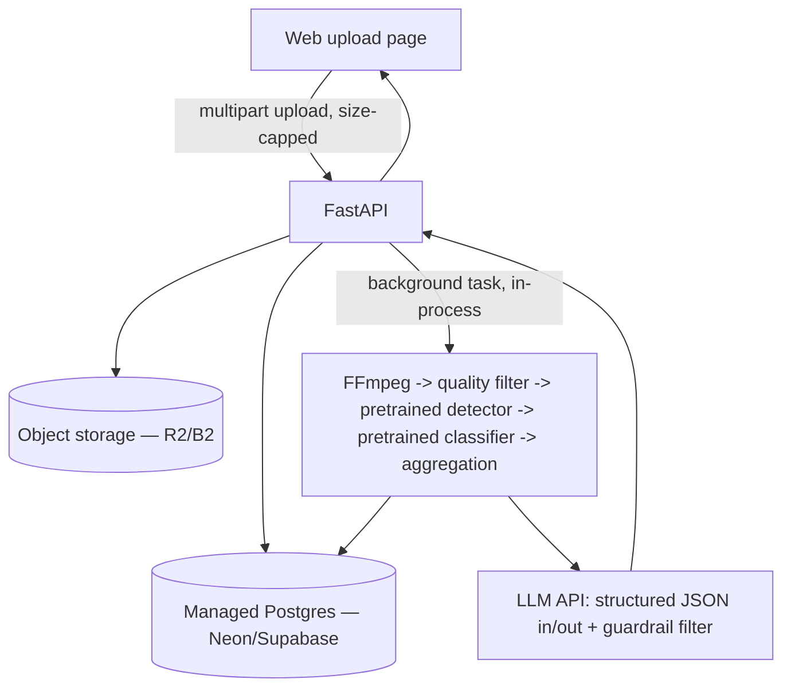

# Fasal Rakshak — One-Week Demo-MVP Sprint Plan

## 0. What this document is (and isn't)

This is **not** a compressed version of the 30-week Implementation Plan. It
is a different plan with a different goal: get a working, publicly-visible
version of the video → diagnosis → report flow live in 7 days, good enough
to demo confidently to stakeholders. The 30-week plan (and its Phase
0–10 backlog) is still the path to a real pilot-ready product — this week
borrows from it selectively and defers almost everything else. Where a task
below maps to a ticket from `Fasal_Rakshak_05_Agentic_Phase_Backlog.md`,
it's tagged `[FR-P#-##]` so you can pick the thread back up afterward
without re-deriving it.

**One governing principle for the whole week:** cut infrastructure and
rigor freely. Do not cut the "never overstate certainty" behavior. A demo
audience remembers a confidently wrong AI far longer than a slow or
obviously-simplified one — so the guardrail filter and honest confidence
language survive every cut below; almost everything else is negotiable.

## 1. Assumptions (stated so you can override any of them)

- 2 builders, ~full days, 7 calendar days.
- Mac M2 Air (8GB, no GPU) is the dev machine; nothing changes about that
  constraint — see the Environment Setup doc's Hardware Reality Check.
- **No model training this week.** Pretrained/off-the-shelf models only
  (public plant-disease classifier checkpoint + YOLO pretrained detector),
  with the accuracy caveats that implies. Real fine-tuning is Phase 3 of the
  full plan, not this week.
- **Web upload page instead of the Flutter app.** Building and shipping a
  mobile app in a week alongside the backend is the highest-risk way to
  spend the time; a browser page that opens the camera/file picker gets you
  the same demo capability in a fraction of the effort. If a Flutter build
  already exists from other work, swap it in for Day 5 and skip the web
  page — everything else in this plan is unaffected either way.
- Soybean only, one crop, one language (English), one region's worth of
  sample footage.
- "Production" here means: **deployed on a real public URL, backed by a
  real database and real object storage, not running on your laptop** —
  not "pilot-hardened, multi-tenant, load-tested." Say this explicitly to
  whoever you're demoing to (see §6).

## 2. Scope cut table

| Area | This week | Deferred to (from the 30-week backlog) |
|---|---|---|
| Model training | Pretrained checkpoints only, no fine-tuning | `FR-P3-03/05/06/07` |
| Video ingestion | Plain multipart upload, size-capped, no resume | `FR-P2-02` (resumable/chunked upload) |
| Frame extraction | Fixed-interval sampling (e.g. 1 frame/sec), not scene-change-aware | `FR-P2-03` |
| Job orchestration | Synchronous/background-task processing, no Celery/Redis queues | `FR-P2-05`, `FR-P4-01` |
| GPU inference | CPU inference on the same small backend instance (models are small); fall back to a hosted inference API only if CPU latency is unacceptable | `FR-P4-01` |
| Aggregation | Simple confidence-weighted average across frames, not full Bayesian/log-odds | `FR-P5-01` |
| Calibration | **Not calibrated.** Confidence numbers are labeled "AI estimate" everywhere, bands set conservatively wide | `FR-P3-07`, `FR-P5-05` |
| Auth/RBAC | Single shared demo password gate, no real user accounts/roles | `FR-P1-04` |
| Agronomist loop | None — no verification, no consensus, no dataset export | `FR-P7-*` |
| B2B/multi-tenant | None | `FR-P9-*` |
| GPS handling | Not collected at all this week (simplest way to avoid the privacy surface entirely) | `FR-PX-01`, PRD §32 |
| Model governance | A single row in `model_versions`, no shadow mode, no release gate automation | `FR-P10-*` |
| **Guardrail filter on LLM output** | **Kept — built Day 4** | `FR-P6-03/04` |
| **Confidence-band language / "AI indication ≠ confirmed diagnosis"** | **Kept — non-negotiable** | PRD §14–15, §33 |
| **Insufficient-evidence path (min-frame threshold)** | **Kept — cheap, prevents embarrassing garbage output** | `FR-P2-06` |

## 3. Simplified architecture for the week

No Redis, no Celery, no separate GPU worker deployment. One FastAPI
service, one Postgres, one bucket. This is intentionally the smallest
architecture that still demonstrates the real pipeline shape (extraction →
detection → classification → aggregation → guarded explanation), just
without the scaling/durability machinery around it.

## 4. Day-by-day plan

### Day 1 — Skeleton live on a public URL
- Managed Postgres + object storage bucket set up (reuse
  `Fasal_Rakshak_08_Environment_Setup.md` §1–2, skip the GPU/Celery-specific
  accounts).
- Minimal schema: `videos`, `video_diagnoses` only — skip `frames`,
  `detections`, `frame_diagnoses` as separate rows this week; store
  per-frame intermediate results as a JSONB blob on `videos` instead of a
  fully normalized table set. (Reintroduce the full schema from
  `Fasal_Rakshak_03_Data_Model_Schema.md` post-demo — don't redesign it, just
  don't populate all of it yet.)
- FastAPI app deployed to a public URL (Render/Railway/Fly.io — pick
  whichever you can get a Docker deploy working on fastest) with a
  `/healthz` check passing in production.
- **Exit check:** a `curl` to the public URL's `/healthz` returns 200.

### Day 2 — Upload + processing pipeline (no models yet)
- Web upload page: file input (works from a phone browser's camera
  picker too), hits `POST /videos`.
- FFmpeg fixed-interval extraction + basic blur/exposure filtering +
  minimum-usable-frame threshold → `insufficient_evidence` path wired end
  to end.
- Runs as a FastAPI `BackgroundTask` (or a simple polling loop), writing
  status directly onto the `videos` row — client polls `GET
  /videos/{id}/status`.
- **Exit check:** upload a real video, watch status move
  `uploaded → processing → (ready or insufficient_evidence)`, with actual
  extracted frames landing in the bucket.

### Day 3 — Pretrained model inference
- Wire in a pretrained YOLO detector (COCO or a public plant/leaf
  checkpoint) and a pretrained PlantVillage-style disease classifier —
  whatever's fastest to get running via a well-supported library (torch
  hub / ultralytics / transformers), no training.
- Run both on CPU in the background task. If per-video latency is
  unacceptable (test with a real ~20s video), fall back same-day to a
  hosted inference API instead of debugging CPU performance further.
- Simple aggregation: confidence-weighted average across frames, top
  disease + rough severity from detection density.
- **Exit check:** a real video produces *some* disease name + numeric
  confidence, end to end, on the deployed instance (not just locally).

### Day 4 — Guarded explanation layer + honest confidence UI
- Structured JSON (crop, disease, confidence, severity, evidence counts)
  → LLM API → farmer-readable text. LLM never sees raw video/frames.
- Guardrail regex/classifier filter rejecting overstated-certainty
  language, with a canned-template fallback — build this even though
  everything else this week is simplified. It's a few hours of work and it's
  what keeps the demo honest.
- Confidence bands (High/Medium/Low) shown with explicit "AI estimate, not
  a confirmed diagnosis" copy, regardless of the fact that calibration
  hasn't been done — if anything, keep the bands conservative (wider Low
  range) precisely because there's no calibration this week.
- **Exit check:** a low-quality or ambiguous video produces a report that
  says "unable to confidently classify," not a confident wrong answer.

### Day 5 — Frontend polish + (optionally) swap in the mobile app
- Turn the Day-2 upload page into something demo-presentable: quality
  score display, processing spinner with real status polling, report
  screen matching the PRD §30 shape (disease, confidence, severity,
  affected-plant estimate, "what we found," "what to do now").
- If a Flutter build exists, point it at the same deployed API instead of
  the web page.
- Basic demo-password gate on the upload page (avoid an open public
  upload endpoint with no friction at all).
- **Exit check:** a person with no context can open the URL, upload a
  video, and read a coherent report without you narrating each step.

### Day 6 — Robustness pass + known-good sample set
- Run 8–10 real videos through the deployed system: a few clean/likely
  disease examples, a few deliberately bad ones (blurry, dark, no plant,
  wrong crop). Fix whatever breaks.
- Curate 3–4 **known-good** sample videos you're confident will produce a
  clean result — these are your live-demo safety net, not a substitute for
  showing a live upload.
- Basic rate limiting / request size cap so a curious visitor can't
  accidentally run up LLM/hosting costs.
- Cost check: confirm what a burst of ~30 demo-day uploads would cost
  (LLM API calls + hosting), so there's no surprise bill.
- **Exit check:** all 8–10 test videos produce either a clean report or a
  correct "insufficient evidence" — nothing produces a broken page or a
  silently wrong confident answer.

### Day 7 — Buffer, rehearsal, fallback
- No new features. Fix whatever Day 6 surfaced.
- Record a short screen-capture of a full successful run (upload → report)
  as a fallback if live wifi/hosting has an issue during the actual demo.
- Rehearse the demo script (§6) once end to end, out loud.
- Write the one-paragraph "what's simplified and why" note (§5) so you're
  not caught flat-footed by a technical question mid-demo.

## 5. What to say about "production" (honesty note)

Say this plainly if asked, rather than letting the polish imply more than
it is: *this is a live, publicly-hosted demo of the real pipeline shape —
upload, quality-checked extraction, detection, classification, aggregation,
a guarded AI-generated report — running on pretrained models with no
Indian field data and no calibration yet.* The accuracy you're seeing is a
floor, not a ceiling: the entire point of Phases 3, 7, and 8 in the full
plan (cold-start fine-tuning, the agronomist verification loop, and real
pilot data collection) is to close exactly that gap. Nothing about this
week's build contradicts the 30-week plan — it's the same architecture at
minimum scope, not a different direction.

## 6. Demo-day playbook

1. Open with a known-good sample video first (guarantees a clean run),
   then do one **live** upload from the browser to show it's not
   pre-canned.
2. If live upload has any hiccup (wifi, cold-start latency, API rate
   limit), fall back to the Day 7 recording without missing a beat — say
   so plainly rather than stalling.
3. Deliberately show one **low-quality or off-target** video to
   demonstrate the "insufficient evidence" / "unable to confidently
   classify" path — this is a feature, not a failure mode, and it's the
   single best way to build trust that the system won't hallucinate a
   confident wrong diagnosis.
4. Close with the honesty note from §5 and a one-line pointer to what
   Phase 3/7/8 of the full plan does next.

## 7. Top risks this week, and mitigations

| Risk | Mitigation |
|---|---|
| Pretrained model is too inaccurate on real field video to look credible | Curate demo videos toward conditions the pretrained model actually handles (Day 6); be upfront that domain adaptation is the next phase, not this week's claim |
| CPU inference too slow for a live demo | Built-in same-day fallback to a hosted inference API (Day 3) |
| LLM API cost/rate-limit surprise from public traffic | Rate limiting + password gate + cost check (Day 6) |
| Time sink on frontend polish crowding out the pipeline | Web page, not a mobile app, by default (§1); polish is Day 5 only, capped |
| Live demo environment fails at the moment of truth | Recorded fallback clip (Day 7), rehearsed switch-over |

## 8. Immediate next steps after the demo

Resume the real plan at `FR-P1-06` (full schema) and `FR-P2-05`
(Celery/queue separation) if the demo lands and a build-out is greenlit —
this week's DB/queue simplifications are the first things to unwind, since
everything downstream (Phase 3 onward) assumes the full schema and durable
job model from the Architecture Reference. Nothing else built this week
needs to be thrown away; it needs to be hardened.